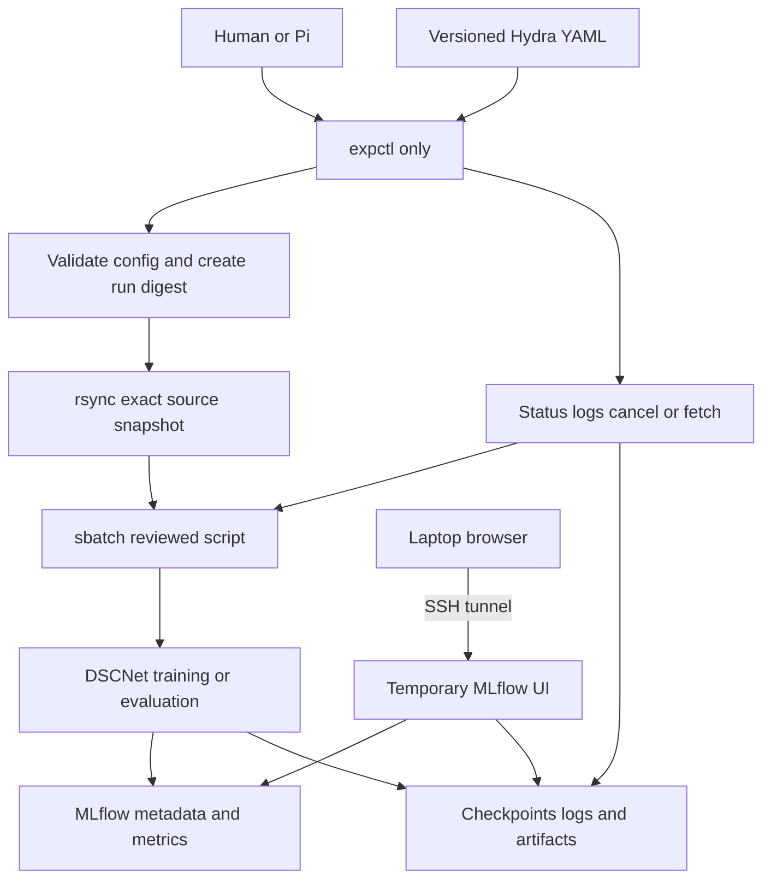
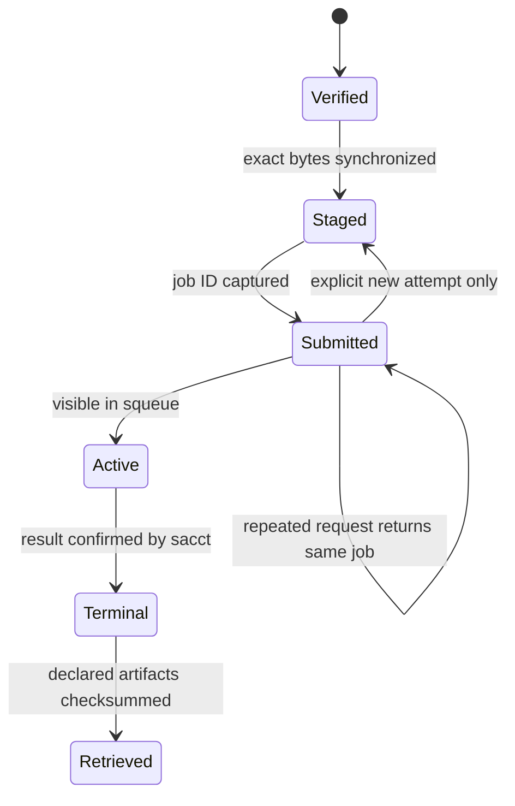
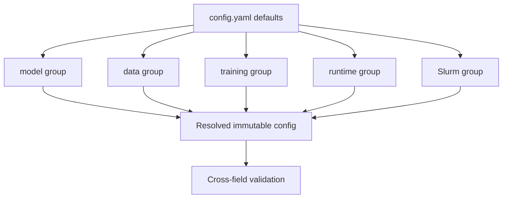
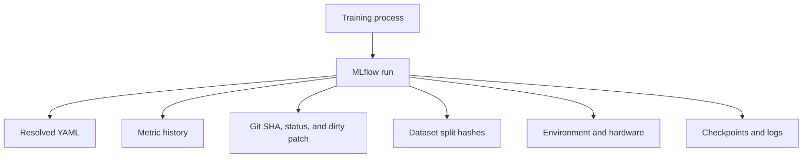
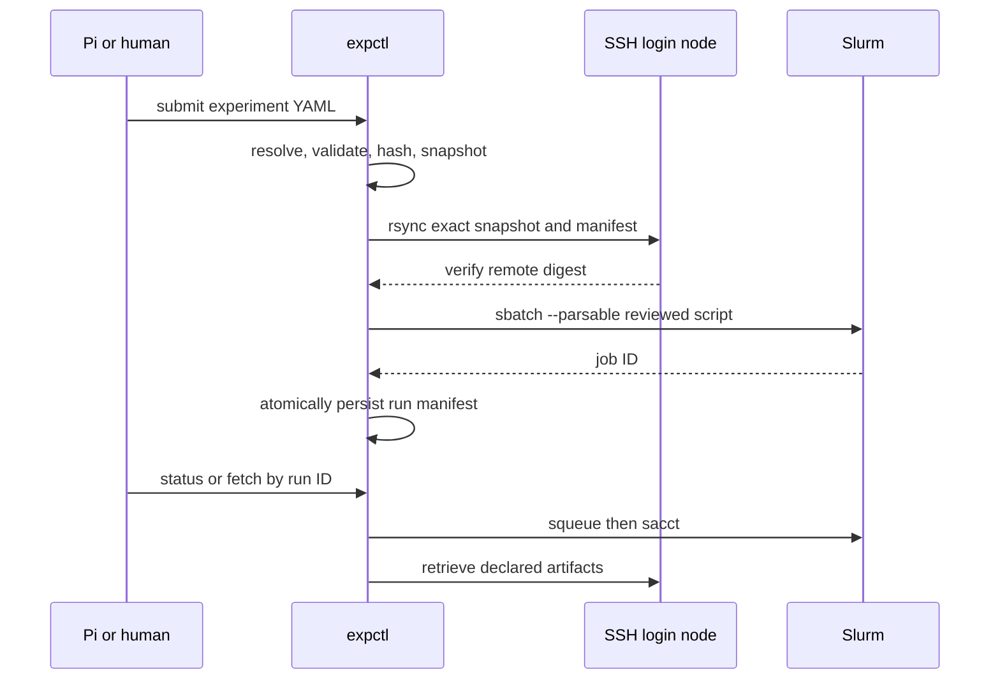
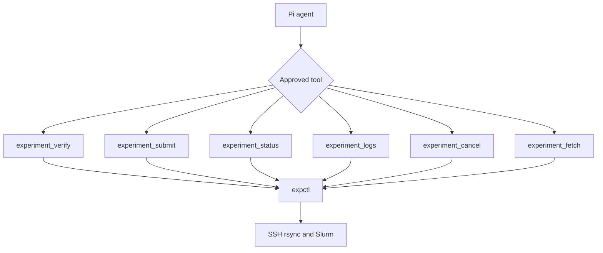
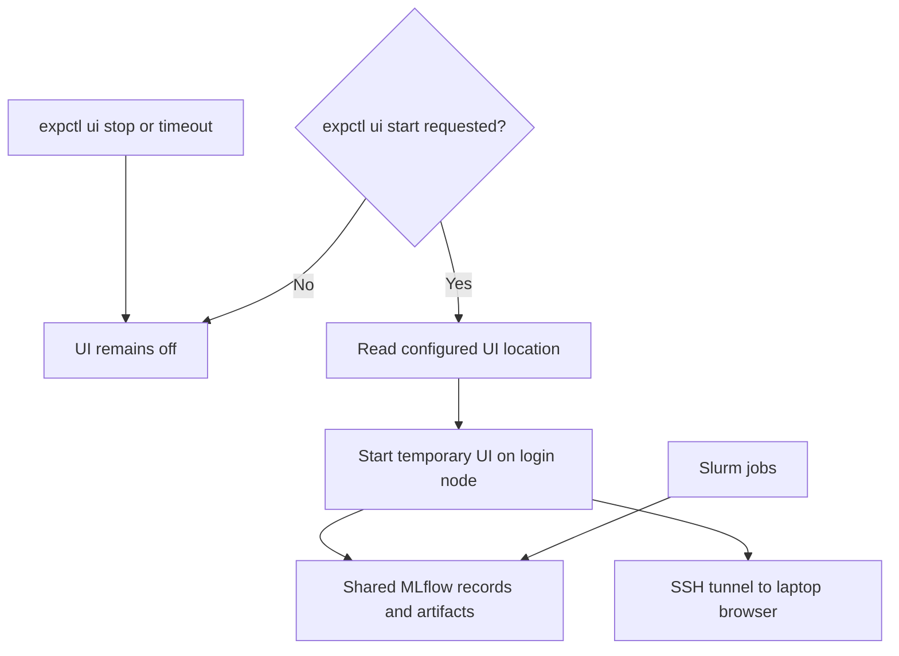

# Reproducible Experiment Management for DSCNet

Replace ad hoc flags and model-directed SSH with one recorded experiment specification and a deterministic path from laptop to Slurm. Pi stays local; the cluster runs reviewed code and stores the resulting evidence.



<Callout type="decision">
**Selected architecture:** Hydra Structured Configs + cluster-local MLflow + a checked-in `expctl` command + a thin project-local Pi extension. Keep the existing explicit `sbatch` boundary. Do not install an agent remotely or expose general remote editing.
</Callout>

<Matrix>
| Responsibility | Owner | Durable record | Must not own |
|---|---|---|---|
| Experiment intent | Hydra | Versioned YAML | Metrics or submission |
| Validation | Typed schema | Resolved YAML | Remote shell text |
| Transport | `expctl` | Run manifest | Model decisions |
| Scheduling | Slurm script | Job ID and resources | Model hyperparameters |
| Observation | MLflow | Metrics and artifacts | Configuration authority |
| Agent interface | Pi extension | Structured tool result | Arbitrary SSH commands |
</Matrix>

## Target run contract

A run contract is a small state machine: each label says what has definitely happened and what evidence must exist before `expctl` may advance. This prevents a failed copy from being called staged, or a rejected submission from being recorded as a running experiment.

| State | Meaning | Required evidence |
|---|---|---|
| Verified | Inputs are valid locally | Resolved config and digest |
| Staged | Exact source and config exist remotely | Matching remote checksums |
| Submitted | Slurm accepted the request | Numeric Slurm job ID |
| Active | Slurm reports queued or running | `squeue` state |
| Terminal | Slurm reports success or failure | `sacct` state and exit code |
| Retrieved | Declared outputs arrived locally | Artifact checksums |



<Callout type="note">
The self-loop on **Submitted** is duplicate protection. Running the same submit command twice does not silently launch two expensive jobs. A deliberate retry creates a new attempt record.
</Callout>

A run identity is derived before submission:

```text
experiment digest = SHA-256(
  Git commit
  + resolved Hydra configuration
  + MiniVess split manifest
  + environment lock identifier
)
```

<Callout type="risk">
The digest identifies experiment inputs; it does not promise bitwise-identical CUDA output. Reproducibility needs both declared settings and observed execution evidence.
</Callout>

<Matrix>
| Evidence | Hydra config | Recorded at runtime | Stored artifact |
|---|---|---|---|
| Seed and deterministic mode | yes | effective values | resolved YAML |
| Requested resources | yes | Slurm allocation | run manifest |
| Actual GPU, driver, CUDA, host | no | yes | environment record |
| Dirty-tree policy | yes | Git status and SHA | patch when allowed |
| Resume state | no | epoch and best score | full checkpoint |
</Matrix>

<Callout type="note">
Yes: the seed and requested deterministic mode belong in Hydra. Hardware model and driver cannot be known reliably until Slurm assigns a node, while optimizer state and RNG state are changing outputs saved inside each checkpoint.
</Callout>

<Phase title="Define the experiment contract" status="planned">

Introduce configuration alongside the current CLI before replacing it. Hydra becomes the sole source of experiment values; model and tracker code only consume the fully resolved, validated object.



Validate at least:

- supported pipeline, model depth, fixed DSConv kernel, and offset behavior;
- ROI compatibility with U-Net depth;
- positive learning rates, epochs, and batch sizes;
- `prepare`, `train`, and `evaluate` artifact requirements;
- one explicit seed and determinism mode;
- paths resolved once, independently of trailing slashes.

<Callout type="note">
**ROI compatibility:** each U-Net downsampling halves every spatial dimension. With four levels, the model downsamples three times, so each ROI dimension must divide by `2³ = 8` unless the decoder explicitly interpolates to skip-connection shapes. `[64, 64, 64]` is valid; a dimension of `66` should be rejected before the model reaches a mismatched concatenation.
</Callout>

<Checklist title="Phase acceptance">
- [ ] A misspelled or unknown key fails before training
- [ ] Unsupported DSConv values fail instead of being ignored
- [ ] Resolved YAML contains every effective model and training value
- [ ] Existing defaults reproduce the current supported configuration
- [ ] Legacy argparse and Hydra paths agree during a temporary shadow test
</Checklist>

</Phase>

<Phase title="Record one complete local run" status="planned">

Add MLflow without changing scheduling. First prove that a run can be understood and replayed from its record.



Use stable metric names for loss, Dice, clDice, precision, recall, false positives, false negatives, and learning rate. Log sparse validation previews only when permitted.

<Checklist title="Phase acceptance">
- [ ] One local smoke run appears in the MLflow UI
- [ ] Its resolved config exactly matches runtime values
- [ ] Git dirty state and patch cannot be mistaken for a clean revision
- [ ] Dataset manifest covers every image-label pair and split
- [ ] Best and latest checkpoints carry complete resumable state
- [ ] Test evaluation is represented as a separate linked run
</Checklist>

</Phase>

<Phase title="Build deterministic cluster control" status="planned">

“Deterministic control” means the agent chooses a bounded operation, then ordinary tested code executes the same command sequence every time. `expctl` is a local state machine, not another agent: it validates, copies, submits, records, checks, and retrieves without improvising remote shell commands.

<Compare>
## Agent operates SSH directly
- pro: flexible during diagnosis
- con: command sequence and records can vary

## Agent calls expctl (pick)
- pro: fixed transitions, validation, and duplicate protection
- con: supported operations must be implemented explicitly
</Compare>

```bash title="Intended interface"
expctl verify configs/experiment/dscnet_standard.yaml
expctl submit configs/experiment/dscnet_standard.yaml
expctl status RUN_ID
expctl logs RUN_ID
expctl cancel RUN_ID
expctl fetch RUN_ID
```



<Callout type="warn">
A repeated `submit` for the same staged run returns the recorded job ID. Launching another attempt requires an explicit option and it should produce a separate attempt record.
</Callout>

<Callout type="note">
`sbatch --parsable` asks Slurm to return a stable value such as `123456` instead of prose such as “Submitted batch job 123456”. `expctl` records a job only when `sbatch` exits successfully and returns a valid ID. An invalid partition, account, or resource request becomes **Submission rejected**, with Slurm's error preserved.
</Callout>

<Callout type="decision">
**Batch size is configurable in Hydra.** Positive values and any chosen project ceiling are checked before submission. Slurm cannot know whether a training batch fits GPU memory: an oversized batch may start and then fail with CUDA out-of-memory. That run is recorded as failed and its logs are surfaced. There is no silent fallback to a smaller batch because that would change the experiment; a retry with a smaller value creates a new config, digest, and run.
</Callout>

<Checklist title="Phase acceptance">
- [ ] Dirty or ambiguous source state is rejected under formal-run policy
- [ ] Remote bytes match the local snapshot manifest
- [ ] Submission uses `sbatch --parsable` and checks exit status
- [ ] `squeue` disappearance falls through to bounded `sacct` retries
- [ ] Host, remote root, account, partition, and resource ceilings are allowlisted
- [ ] Artifact retrieval uses declared paths and verifies checksums
- [ ] Fake SSH and Slurm tests cover failure and duplicate-submit cases
</Checklist>

</Phase>

<Phase title="Expose narrow Pi tools" status="planned">

Wrap `expctl` rather than reimplementing orchestration in the extension. Each tool accepts bounded structured inputs and returns the controller's JSON record.



<Callout type="decision">
Keep the currently working Vindula SSH tools for inspection, diagnosis, and exceptional remote work. Do not patch their installed, update-managed source. Build the experiment path beside them: `expctl` uses the same `xlogin1` alias and one-shot SSH pattern, and the project-owned Pi extension wraps `expctl`. The Vindula implementation remains useful reference material rather than being replaced.
</Callout>

<Compare>
## Patch installed Vindula package
- pro: smallest apparent code change
- con: overwritten by updates and mixes generic SSH with experiment policy

## Fork the whole SSH extension
- pro: complete control
- con: permanent maintenance burden

## Add expctl beside Vindula (pick)
- pro: preserves working diagnostics and isolates reproducible job control
- con: one small project-specific interface to maintain
</Compare>

<Checklist title="Phase acceptance">
- [ ] The extension exposes no arbitrary host or command parameter
- [ ] The remote needs no Pi, MCP server, model credentials, or coding agent
- [ ] Cancellation requires an existing recorded job identifier
- [ ] Pi and direct CLI calls produce the same manifests and outcomes
- [ ] Extension and controller versions are recorded with each run
</Checklist>

</Phase>

<Phase title="Host MLflow on the cluster filesystem" status="planned">

Training and viewing are independent. Slurm jobs always write MLflow records to shared storage. The web UI is normally off; starting or stopping it does not affect training or stored runs.



```yaml title="configs/runtime/slurm.yaml"
mlflow:
  ui:
    location: login
```

<Callout type="decision">
`location: login` says **where `expctl ui start` should create the temporary viewer**. It does not mean the UI is always running. The runtime state is off by default, and only an explicit start request turns it on. A `none` location would conflate “not running now” with “UI is disabled”; if disabling the capability is ever needed, use a separate `enabled: false` setting.
</Callout>

```bash title="The same temporary reader in either permitted location"
mlflow ui \
  --backend-store-uri "file://${HOME}/urop/mlflow/runs" \
  --host 127.0.0.1 \
  --port 5000
```

<Compare>
## On-demand login-node UI (pick)
- pro: policy permits it and the tunnel is simple
- pro: no Slurm allocation while viewing
- con: must remain temporary and localhost-only

## Interactive CPU location override
- pro: available if login-node policy changes
- con: requires a small allocation and an extra tunnel hop

## Persistent lab service later
- pro: stable shared URL and stronger multi-user storage
- con: requires VM ownership, authentication, backups, and policy approval
</Compare>

<Checklist title="Phase acceptance">
- [ ] Compute nodes can write the selected shared directory while the UI is off
- [ ] Runtime config accepts only `login` or `slurm` as UI locations
- [ ] `expctl ui start` is required before any viewer process exists
- [ ] The reader and tunnel never expose the UI publicly
- [ ] Stop or timeout leaves runs and training unaffected
- [ ] Representative checkpoints fit storage and transfer limits
- [ ] Backup and retention behavior is documented
</Checklist>

</Phase>

<Phase title="Cut over and prove recovery" status="planned">

After shadow-mode equivalence, remove duplicate configuration ownership from `src/dscnet/workflow.py` and `scripts/run_slurm.sh`. Test interruption, resume, awkward-volume inference, and retrieval before treating the workflow as experiment-ready.

<Checklist title="Experiment-ready gate">
- [ ] Same seed and configuration reproduce the expected deterministic smoke result
- [ ] Interrupted training resumes optimizer, scheduler, scaler, epoch, RNG, and best score
- [ ] Shared sliding-window inference covers every voxel without NaNs
- [ ] Every advertised DSConv setting changes tested behavior or is fixed and absent from config
- [ ] `prepare`, `train`, and `evaluate` remain separate
- [ ] A run can be reconstructed from manifest, source snapshot, config, environment, and data hashes
- [ ] One local and one short Slurm run pass end to end
- [ ] Existing legacy path is removed only after equivalence is demonstrated
</Checklist>

</Phase>

## Planned file changes

<FileTree>
- add configs/config.yaml -- Hydra composition root
- add configs/model/dscnet_standard.yaml -- supported standard model
- add configs/model/dscnet_optimized.yaml -- supported optimized model
- add configs/data/minivess_half.yaml -- dataset and split identity
- add configs/training/default.yaml -- optimization and determinism
- add configs/runtime/local.yaml -- local execution paths
- add configs/runtime/slurm.yaml -- reviewed cluster defaults
- add configs/experiment/ -- named experiment specifications
- add src/dscnet/experiment/config.py -- typed schemas and semantic validation
- add src/dscnet/experiment/tracking.py -- MLflow and provenance boundary
- add tools/expctl.py -- deterministic verify, submit, inspect, and fetch CLI
- add .pi/extensions/experiment-manager.ts -- narrow Pi wrapper around expctl
- add tests/test_experiment_config.py -- schema and ignored-option failures
- add tests/test_experiment_tracking.py -- recorded provenance contract
- add tests/test_expctl.py -- fake SSH and Slurm lifecycle
- modify src/dscnet/workflow.py -- temporary adapter, then Hydra entry point
- modify scripts/run_slurm.sh -- cluster bootstrap only
- modify pyproject.toml and uv.lock -- pinned Hydra and MLflow dependency authority
- modify docs/usage.md -- human workflow and recovery steps
</FileTree>

<Callout type="note">
Keep the current staged model deletions and functional correctness cleanup separate from this feature. Land the experiment-management work in incremental functional commits after the current cleanup is resolved.
</Callout>

## Recommended defaults for unresolved decisions

<Questions title="Decisions needed before implementation">
- Which remote layout should we adopt?
  - **Recommended:** keep the checkout at `/home/a/andrewsq/dev/urop/dscnet`; put immutable runs and MLflow under `/home/a/andrewsq/data/urop/experiments`. This separates mutable source from generated evidence and keeps runs near the canonical dataset. Confirm quota and backup policy first.
  - Put everything under the repository. Simpler path, but generated state contaminates the checkout.
- What source-state policy should formal runs use?
  - **Recommended:** require a clean committed tree for formal runs; allow a captured dirty patch only for runs explicitly tagged development. Formal results then point to an immutable revision without blocking quick trials.
  - Allow dirty state for every run. Convenient, but weakens the meaning of a revision.
- Which artifacts should be retrieved automatically?
  - **Recommended:** manifests, resolved config, logs, final metrics, and best checkpoint. Fetch prediction volumes and all checkpoints explicitly because they are large and often unnecessary locally.
  - Retrieve every artifact. Complete locally, but expensive and slow.
  - Retrieve metadata only. Fast, but leaves the most useful recovery checkpoint remote.
- Which SSH and Slurm limits should be trusted initially?
  - **Recommended:** use `xlogin1` and begin with the currently reviewed envelope: `gpu-long`, one `a100-40`, 32 GB memory, 8 CPUs, and 48 hours. Resolve the required Slurm account from cluster documentation before implementation and fail closed on unknown values.
  - Permit arbitrary targets and resources. Flexible, but defeats validation and the narrow trust boundary.
</Questions>

<Checklist title="Whole-plan completion">
- [ ] One typed YAML is the only experiment specification authority
- [ ] One digest binds code, configuration, data, and environment identity
- [ ] One deterministic controller owns sync and Slurm transitions
- [ ] Pi exposes only bounded experiment operations
- [ ] MLflow stores searchable metrics and declared artifacts
- [ ] The cluster runs no remote agent
- [ ] Formal experiments are reproducible, resumable, and auditable
</Checklist>
